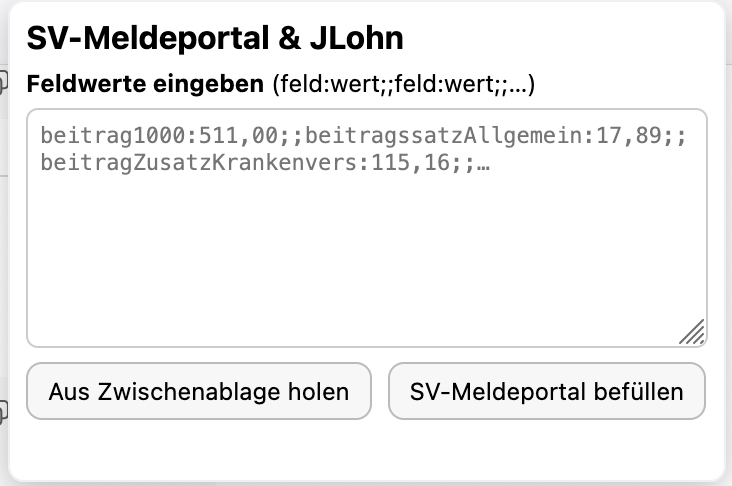
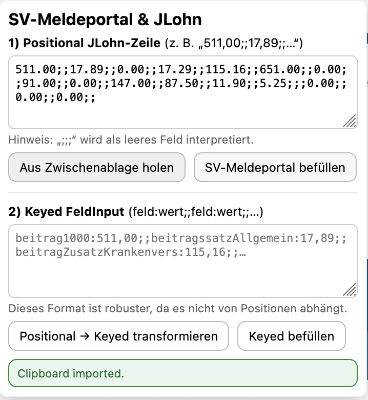
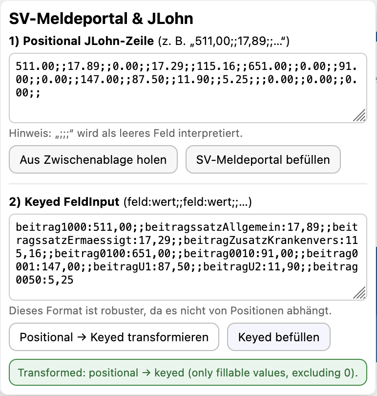
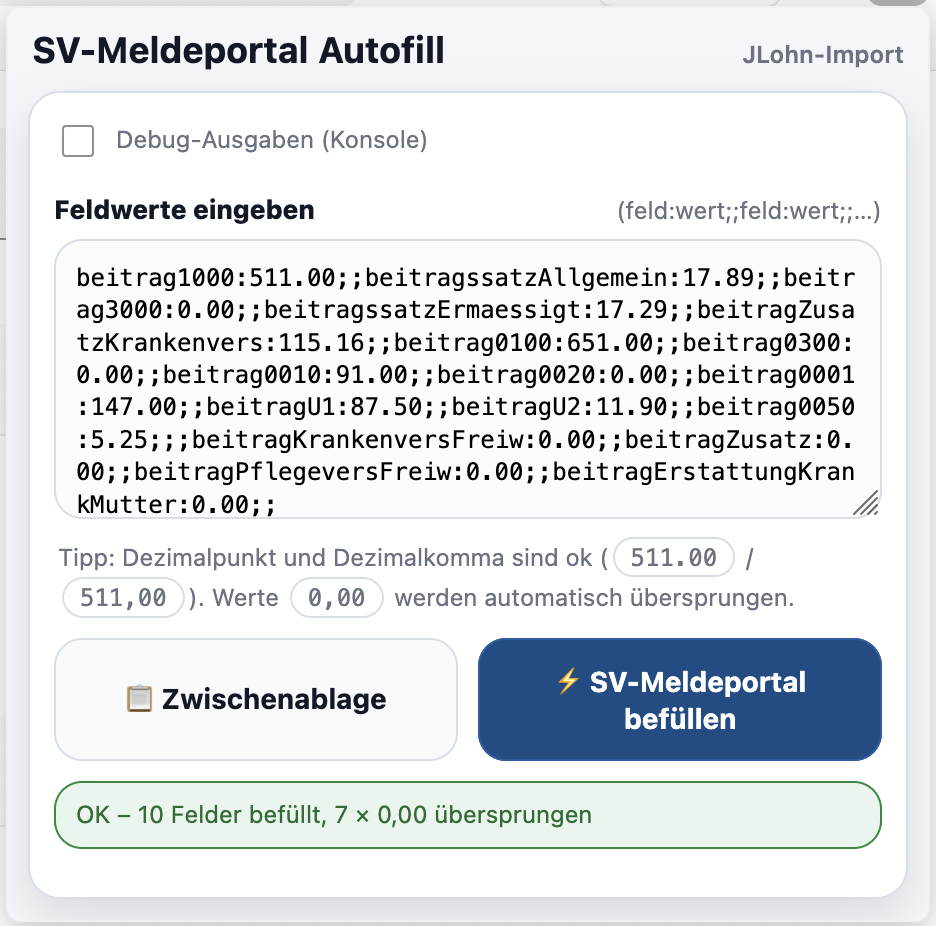

# SV-Meldeportal JLohn Autofill

Cross-browser (Chrome, Edge, Firefox) extension that autofills contribution fields in the German **SV-Meldeportal**
from a **JLohn export line** ([JLohn](https://www.jlohn.de/wordpress/)).

## Screenshots

Popup workflow (examples):

| Positional + Keyed input                                          | Clipboard import status                                                       |
| ----------------------------------------------------------------- | ----------------------------------------------------------------------------- |
|  |  |

| Positional → Keyed transformation                                                                | Keyed fill result                                          |
| ------------------------------------------------------------------------------------------------ | ---------------------------------------------------------- |
|  |  |

## Features

- Popup UI with **positional** JLohn input and **keyed** format (`field:value;;field:value`)
- Optional clipboard import (**only after explicit user click**)
- Optional transformation **positional → keyed** (keeps only fillable values, excluding `0,00`)
- Status line in popup (clipboard imported / transformed / filled result)
- Autofill triggers `input`/`change`/`blur` events so frameworks react correctly
- **Offline-only** (no telemetry, no network calls)

## Permissions (store review friendly)

| Permission         | Why it is needed                                         | When it is used                               |
| ------------------ | -------------------------------------------------------- | --------------------------------------------- |
| `activeTab`        | Access the active SV-Meldeportal tab after a user action | Only after clicking **Fill**                  |
| `scripting`        | Inject the content script on demand into the active tab  | Only after clicking **Fill**                  |
| `clipboardRead`    | Read JLohn line from clipboard                           | Only after clicking **Import from clipboard** |
| `host_permissions` | Restrict script injection to `sv-meldeportal.de`         | Only for matching SV pages                    |

**Data handling:** No data is transmitted. Processing happens locally in the browser.

## Project structure

- `src/popup/*` – popup UI logic
- `src/content/*` – content script that fills the form
- `src/shared/*` – pure helpers (transform, number normalization, field list)
- `tests/*` – unit tests (Vitest + JSDOM)
- `.github/workflows/ci.yml` – GitHub Actions CI (format check + lint + tests + build)
- `docs/store-listing.md` – store-ready listing texts

## Commands

### Install

```bash
npm install
```

### Format

```bash
npm run format
npm run format:check
```

### Lint

```bash
npm run lint
```

### Tests

```bash
npm test
npm run test:watch
npm run test:coverage
Coverage output in coverage/.
```

### Build (release)

```bash
npm run build

Outputs:
dist/chrome/ and dist/sv-meldeportal-jlohn-autofill-<version>-chrome-edge.zip
dist/firefox/ and dist/sv-meldeportal-jlohn-autofill-<version>-firefox.zip
dist/sv-meldeportal-jlohn-autofill-<version>-full-project.zip
```

### Debugging

Set `localStorage.SV_AUTOFILL_DEBUG = "1"` in popup DevTools or page DevTools.

## Review FAQ (store reviewers)

#### Does this extension collect or transmit personal data?

No. The extension does not send any data to servers. All parsing and form filling happens locally in the browser.

#### Why does it request clipboardRead?

Used only after the user clicks Import from clipboard in the popup.

#### Why activeTab and scripting?

Used only to inject/run the content script in the active SV-Meldeportal tab after clicking Fill.

#### What sites can it run on?

Restricted to sv-meldeportal.de via host permissions.

#### Why are there multiple config files?

build.mjs builds the extension and creates ZIP files.
vitest.config.js configures unit tests + coverage.

## License

Apache License 2.0 – see LICENSE.
